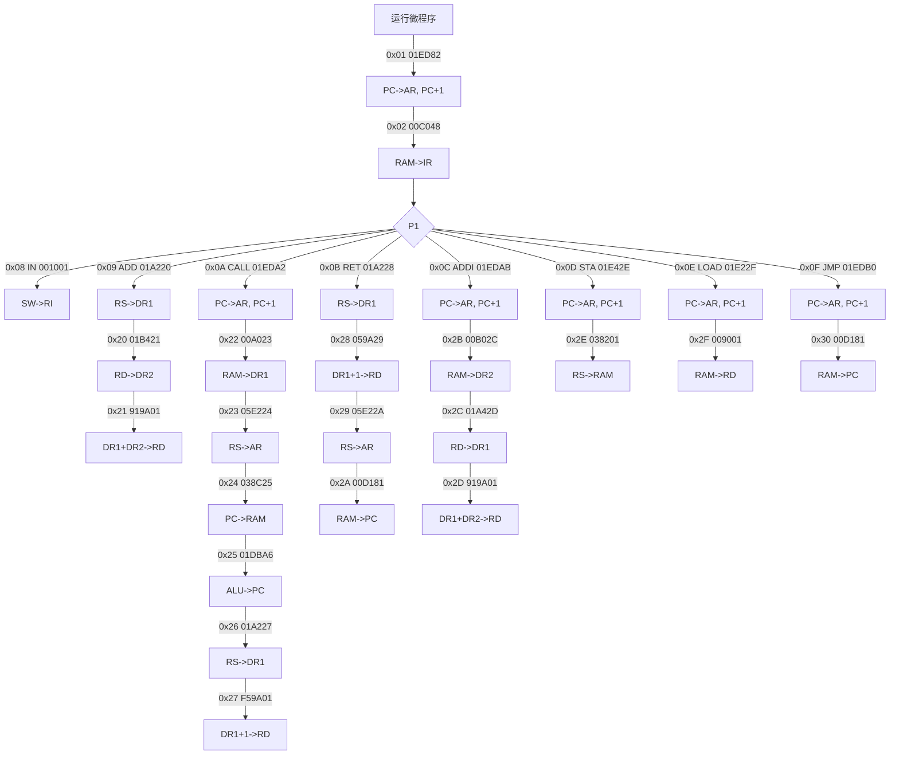
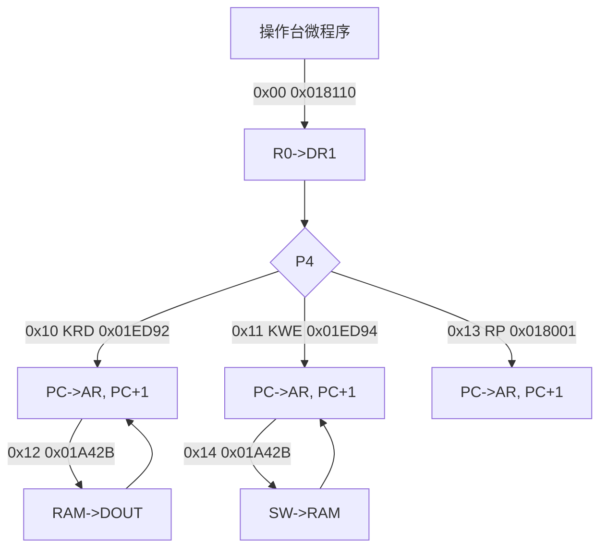

# 运行微程序

```mermaid
flowchart TD
    运行微程序 -->|0x01 01ED82| A[PC->AR, PC+1]
	A -->|0x02 00C048| B[RAM->IR]
    B --> C{P1}
    C -->|0x08 IN 001001| D0[SW->RI]
    C -->|0x09 ADD 01A220| E0[RS->DR1]
    C -->|0x0A CALL 01EDA2| F0[PC->AR, PC+1]
    C -->|0x0B RET 01A228| G0[RS->DR1]
    C -->|0x0C ADDI 01EDAB| H0[PC->AR, PC+1]
    C -->|0x0D STA 01E42E| I0[PC->AR, PC+1]
    C -->|0x0E LOAD 01E22F| J0[PC->AR, PC+1]
    C -->|0x0F JMP 01EDB0| K0[PC->AR, PC+1]
    
    E0 -->|0x20 01B421| E1[RD->DR2]
    E1 -->|0x21 919A01| E2[DR1+DR2->RD]

    F0 -->|0x22 00A023| F1[RAM->DR1]
    F1 -->|0x23 05E224| F2[RS->AR]
    F2 -->|0x24 038C25| F3[PC->RAM]
    F3 -->|0x25 01DBA6| F4[ALU->PC]
    F4 -->|0x26 01A227| F5[RS->DR1]
    F5 -->|0x27 F59A01| F6[DR1+1->RD]

    G0 -->|0x28 059A29| G1[DR1+1->RD]
    G1 -->|0x29 05E22A| G2[RS->AR]
    G2 -->|0x2A 00D181| G3[RAM->PC]

    H0 -->|0x2B 00B02C| H1[RAM->DR2]
    H1 -->|0x2C 01A42D| H2[RD->DR1]
    H2 -->|0x2D 919A01| H3[DR1+DR2->RD]

    I0 -->|0x2E 038201| I1[RS->RAM]

    J0 -->|0x2F 009001| J1[RAM->RD]

    K0 -->|0x30 00D181| K1[RAM->PC]
```

# 操作台微程序

```mermaid
flowchart TD
    操作台微程序 -->|0x00 0x018110| A[R0->DR1]
    A --> B{P4}
    B -->|0x10 KRD 0x01ED92| C0[PC->AR, PC+1]
    B -->|0x11 KWE 0x01ED94| D0[PC->AR, PC+1]
    B -->|0x13 RP  0x018001| E0[PC->AR, PC+1]

    C0 -->|0x12 0x01A42B| C1[RAM->DOUT]
    C1 --> C0
    D0 -->|0x14 0x01A42B| D1[SW->RAM]
    D1 --> D0
```